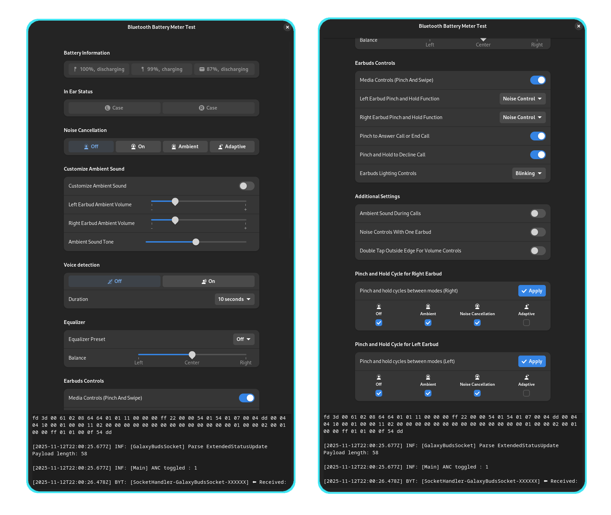

### Samsung Galaxy Buds Testing App

This script is intended for the development and testing of socket connection and feature-specific code for AirPods.
Successful implementations can later be migrated into the GNOME extension **Bluetooth Battery Meter**.

It allows socket-level experimentation and debugging in avoiding GNOME Shell restarts or crashes, making it much easier to run and debug.

>Note!
> 
>This is a rough prototype and may contain bugs.

---

### Instructions

1. **Disable any other extension or application** that may be accessing AirPods sockets.
2. Install schema (Updated instruction)
3. ~~Edit **main.js** and set your Sony buds devicePath (replace XX with the device's MAC address).~~
3. **Edit `macAddress.js`** and set your Samsung Galaxy Buds buds `MAC Address`. Replace `XX` with the device's MAC address. (Updated instruction)
4. **Ensure your Samsung Galaxy Buds buds are connected** before running the script.
5. **Execute the script via terminal**:

Updated Instructions:

1. 

Migrating the fully working Sony script into the GNOME Shell extension turned out to be unexpectedly difficult, and it caused a lot of extra work for both me and testers. To avoid repeating that situation, I’m now writing the code in a way that matches how it will actually run inside the extension. This lets us avoid unnecessary rewrites and retesting later.

Because the extension and the preferences window communicate through a GSettings schema, we need to install the schema before the Device class and the ConfigureWindow class can exchange data.

Run the command below once to install the schema.
After it’s installed, the script will automatically detect and use it.
```
install-schema.sh install
```


```
gjs-console -m /path/to/main.js
```

### GUI


